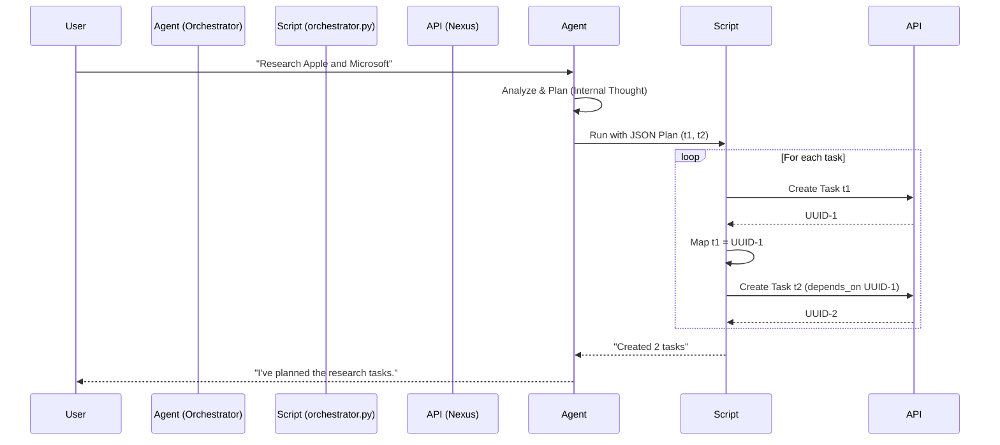

# Design: Orchestrator Skill Architecture

## Goals
- **Decoupled Logic**: The LLM focuses on *planning* (text/JSON generation), while the script handles *execution* (API calls, ID mapping).
- **Zero-Dependency Script**: The execution script should rely only on the Python standard library to ensure it runs easily in any environment where the agent operates.
- **API-First**: Use the existing Nexus REST API (`/api/nexus/tasks`) instead of internal Python imports to avoid tight coupling with the core codebase.

## Components

### 1. The Skill Definition (`SKILL.md`)
Acts as the "System Prompt" for the Orchestrator capability.
- **Persona**: "Chief Task Orchestrator".
- **Input**: Natural language user request.
- **Output**: Strict JSON schema defining a list of tasks with:
    - `id`: Temporary logical ID (e.g., "t1", "t2").
    - `depends_on`: List of temporary IDs this task depends on.
    - `title`, `description`, `priority`.

### 2. The Execution Script (`orchestrator.py`)
Acts as the "Actuator".
- **Interface**: CLI argument `--plan '<json_string>'`.
- **Logic**:
    1.  Parse JSON.
    2.  Iterate through tasks.
    3.  Resolve Dependencies: Maintain a `temp_id -> real_uuid` map. When a task specifies `depends_on: ["t1"]`, look up `t1`'s real UUID from the map.
    4.  Call API: `POST http://localhost:8000/api/nexus/tasks`.
    5.  Update Map: Store the returned UUID for the current task's `temp_id`.

## Data Flow

